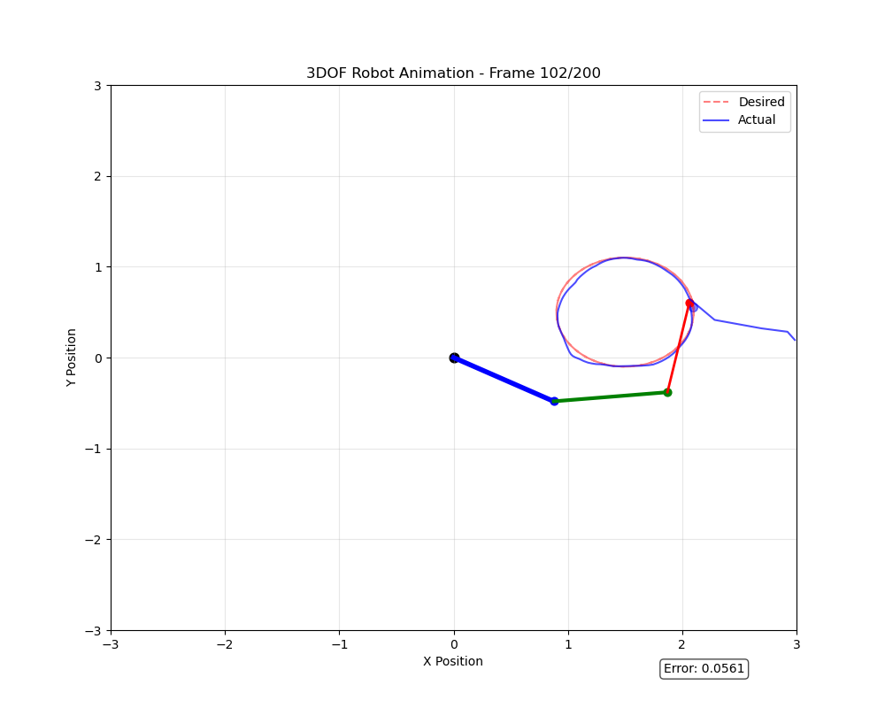
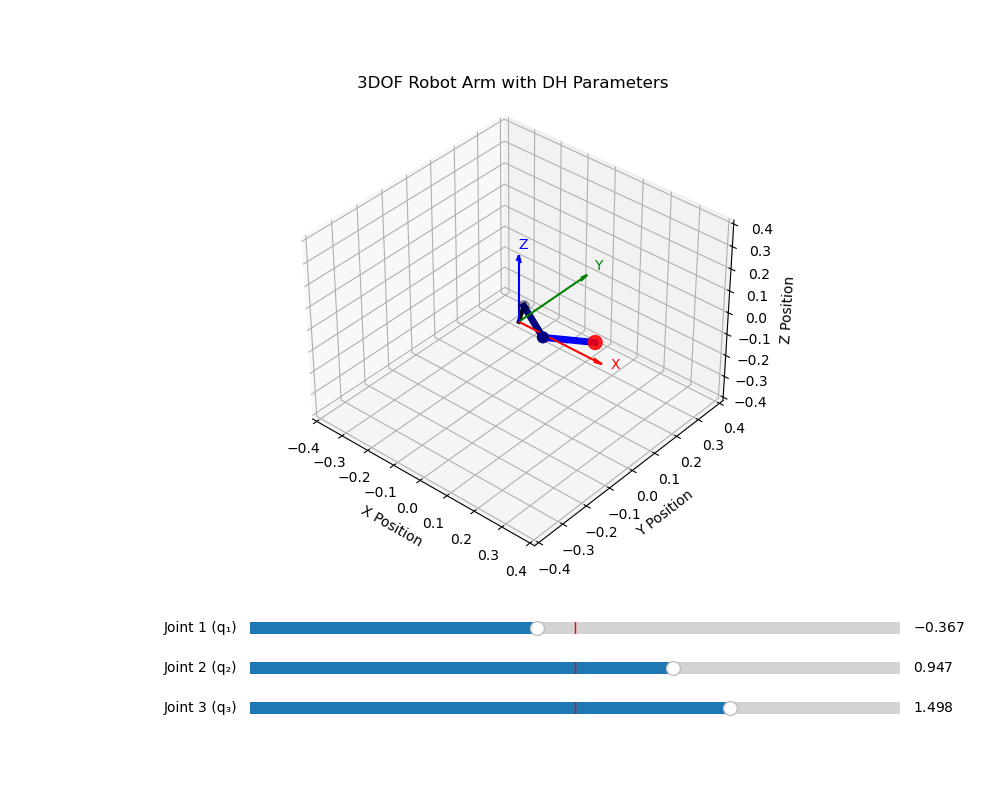

# Neural Network Inverse Kinematics

Solve inverse kinematics for 2-DOF and 3-DOF robotic manipulators using neural networks. Given desired end-effector coordinates, the network predicts required joint angles.

## Overview

This project trains feedforward neural networks to learn the inverse kinematic mapping for 2 DoF and 3 DoF robotic manipulators. The networks take end-effector positions in task space (x, y) and previous joint states as input, and output joint angles.

Running the test files includes real-time visualization:


This has been demonstrated to work on real manipulator I've been working on

## Dataset Generation

Datasets are created using forward kinematics:
- Forward kinematics calculates end-effector positions for each joint configuration
- Multiple samples are generated per configuration with small random joint perturbations (±0.1 rad) - this is treated as previous position of the joint (mimicking high-frequency controllers). This also teaches the network about local solution spaces and smooths trajectory following

**Dataset structure:**
- Input: end-effector position (x, y) + previous joint state
- Output: joint angles that reach this position

## Project Structure

- [3_dof](3_dof) - dataset generation, training, testing of 3_dof robot,
- [2_dof](2_dof) - dataset generation, training, testing of 2_dof robot,
- [real_robot](real_robot) - scripts meant for real robot - it differs mainly with the joint configuration. The files are also not cleaned-up.
- [kinematics_visualizations](kinematics_visualizations) - scripts for visuzalizing forward and inverse kinematics. It was used as a reference when developing the program. Scripts have sliders for control:




## Requirements

```
numpy
pandas
scikit-learn
keras
tensorflow
matplotlib
```

Install: `pip install -r requirements.txt`

## Usage

### 3-DoF Robot

```bash
cd 3_dof

# 1. Generate dataset
python 3dof_generate.py

# 2. Train model
python 3_dof_train.py

# 3. Test trajectory following
python 3_dof_test.py
```

Its the same for 2 DoF robot

### kinematics visualiations
```bash
python inverse_sim.py
```
## Neural Network Architecture

**2-DOF Model:**
- Input: 4 features (x, y, prev_θ₁, prev_θ₂)
- Hidden: 64 → 64 neurons (ReLU)
- Output: 2 joint angles
- Loss: MSE, Optimizer: Adam

**3-DOF Model:**
- Input: 5 features (x, y, prev_θ₁, prev_θ₂, prev_θ₃)
- Hidden: 128 → 128 → 64 neurons (ReLU)
- Output: 3 joint angles
- Loss: MSE, Optimizer: Adam

Training includes early stopping based on validation MAE to prevent overfitting.

## Notes

- Link lengths: L₁ = L₂ = L₃ = 1.0 meters
- Joint ranges: [-π, π] radians